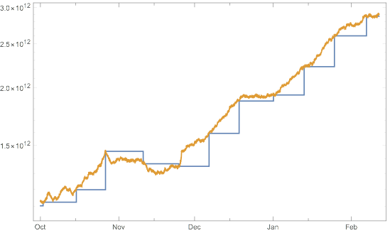

# Bitcoin Difficulty Estimate

This is a small program to extract Bitcoin block headers from
a bitcoin node running locally (ip: 127.0.0.1 port 8333) and
compute a history and real time estimate of Bitcoin difficulty.

The estimation is documented here: https://medium.com/@tamas.blummer/estimating-next-bitcoin-mining-difficulty-3ea85e7a8adb

The output on stdout is a csv file with following field:
- block height
- block time point (unix timestamp)
- network difficulty - this changes only at every 2016th block
- next difficulty estimate - this changes with every block and converges at low volatility to network difficulty

## Build instructions
Need:
- rust 1.23 or higher, get it fom https://www.rust-lang.org/en-US/
- clone https://github.com/tamasblummer/rust-bitcoin into a directory parallel to the one you cloned this repo. This requirement mit go away as soon as https://github.com/apoelstra/rust-bitcoin
merges https://github.com/apoelstra/rust-bitcoin/pull/44

Build:
- cargo build --release

Run:

target/release/bitcoin-diffest > difftest.txt

It should take ca 10 minutes if built as above for release running on an Intel i7 processor,
at block height of 508829.

I checked in a run result for those curious how it looks like before running it with real time data.

Above example result visualized for last blocks:

